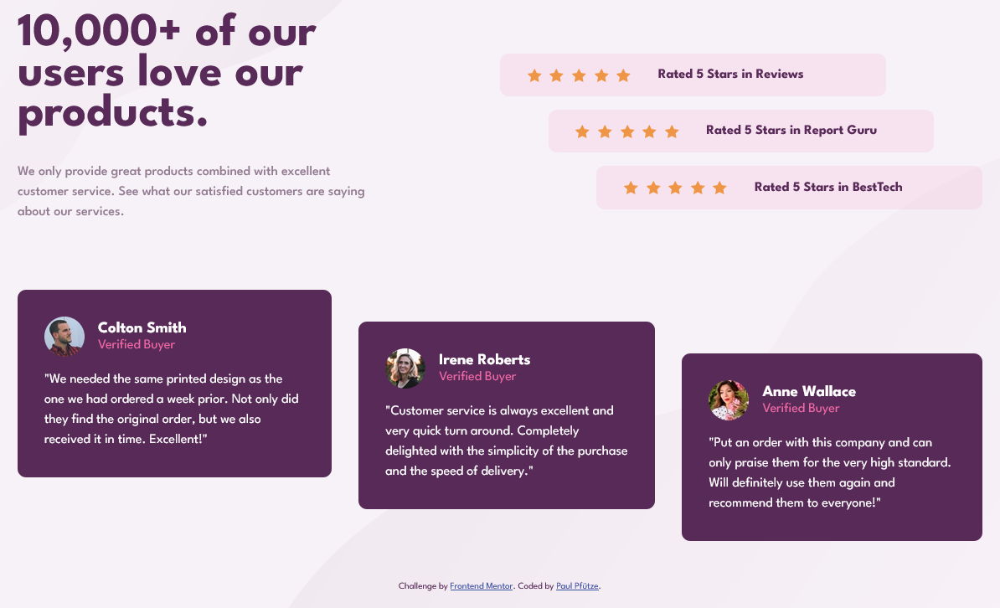
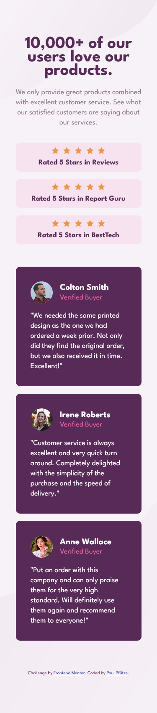

# Frontend Mentor - Social proof section solution

This is a solution to the [Social proof section challenge on Frontend Mentor](https://www.frontendmentor.io/challenges/social-proof-section-6e0qTv_bA).

## Table of contents

- [Overview](#overview)
  - [The challenge](#the-challenge)
  - [Screenshot](#screenshot)
  - [Links](#links)
- [My process](#my-process)
  - [Built with](#built-with)
  - [What I learned](#what-i-learned)
- [Author](#author)

## Overview

### The challenge

Users should be able to:

- View the optimal layout for the section depending on their device's screen size

### Screenshot

### Links

- Solution URL: [https://www.frontendmentor.io/solutions/mobilefirst-social-proof-section-8trWp0xO67](https://www.frontendmentor.io/solutions/mobilefirst-social-proof-section-8trWp0xO67)
- Live Site URL: [https://sutontoch.github.io/social-proof-section/](https://sutontoch.github.io/social-proof-section/)

## My process

### Built with

- Semantic HTML5 markup
- CSS custom properties
- Flexbox
- Mobile-first workflow

### What I learned

- If you want to change the height of an image dynamically, provide a container that changes it's height

## Author

- Frontend Mentor - [@SutonToch](https://www.frontendmentor.io/profile/SutonToch)